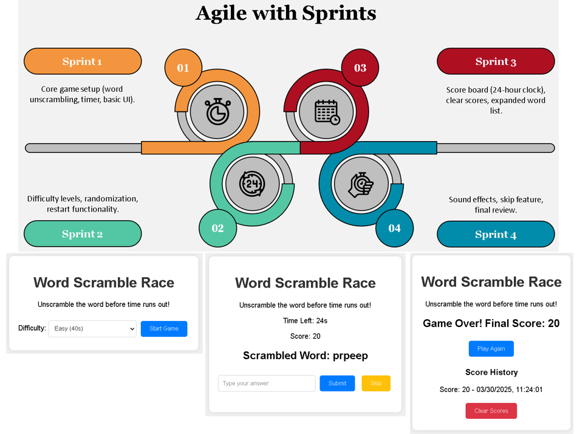

# Word Scramble Race

## Graphical Abstract
  
*Single-player game where users unscramble random popular words against a customizable timer.*

## Purpose of the Software
- **Type of Software Development Process**: Agile  
  - **Why Agile?**: Facilitates iterative feature additions (e.g., difficulty, skip option) with rapid testing. Ideal for a demo-stage project with expansion potential.
- **Possible Usage**: Educational tool for vocabulary and typing practice, casual gaming for entertainment.  
- **Target Market**: Students, educators, casual gamers, language learners.

## Software Development Plan
- **Development Process**: Agile with sprints:  
  - Sprint 1: Core game setup (word unscrambling, timer, basic UI).  
  - Sprint 2: Difficulty levels, randomization, restart functionality.  
  - Sprint 3: Score board, clear scores, word list (300 words).  
  - Sprint 4: Sound effects, unlimited skip feature, exit button, final review. 
- **Members**:  
  - **P2304262 VONG WAI PONG (Frontend Developer)**: Oversees project, develops HTML/CSS structure (20%).  
  - **P2304469 FOK HOU IN (Backend Developer)**: Implements JavaScript logic (game mechanics, scoring, unlimited skips, exit features) (20%).  
  - **P2321073 PAN YUBIN (UI/UX Designer)**: Designs and refines CSS for a basic UI (20%).  
  - **P2321299 WU YIER (Tester & Bug Fixer)**: Tests game, ensures functionality across browsers (20%).  
  - **P2321358 MO XUFENG (Documentation & Demo Specialist)**: Writes documentation, creates demo video (20%).
- **Schedule**:  
  - Week 1 [24 Mar-28 Mar]: Planning, basic setup, core logic.  
  - Week 2 [31 Mar-04 Apr]: Difficulty, random words, restart feature.  
  - Week 3 [07 Apr-11 Apr]: Score board, clear scores, 300-word list.  
  - Week 4 [14 Apr-18 Apr]: Sound effects, unlimited skips, exit button, testing, documentation, demo video
- **Algorithm**:  
  1. Generate a random scrambled word from a 300-word bank on demand.  
  2. Set timer based on difficulty (20-40s).  
  3. Compare user input to original word, update score; allow unlimited skipping or exiting early.  
  4. End game when time’s up or user exits, save score history.
- **Current Status**: Fully functional demo with difficulty levels, 300+ popular words, random selection, restart, score history, clear scores, sound effects, unlimited skip feature, and an exit button.  
- **Future Plan**: Add online leaderboards, word categories (e.g., animals, food), mobile optimization.

## Demo
https://www.youtube.com/

## Environment
- **Programming Language**: HTML, CSS, JavaScript  
- **Minimum Requirements**: Modern web browser (Chrome, Firefox, etc.)  
- **Hardware**: Any device with a browser and audio output  
- **Required Packages**: None
- **Notes**: Sound effects use external URLs; replace with local files for offline use.

## Declaration
- No external libraries used. Sound effects sourced from [SoundJay](https://www.soundjay.com) (free for non-commercial use). All other code is original.
