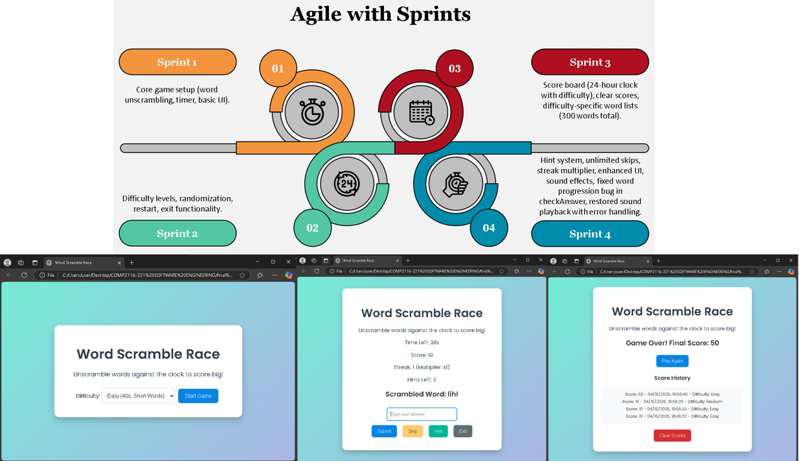

# (Group Name: The Anagram Avengers)
# Web Game - Word Scramble Race

## Graphical Abstract
  
*Single-player game where users unscramble random words tailored to difficulty, racing against a customizable timer with hints and streak bonuses.*

## Purpose of the Software
- **Type of Software Development Process**: Agile  
  - **Why Agile?**: Enables iterative feature additions (e.g., hints, streak multiplier, difficulty-specific words) with rapid testing. Ideal for a demo-stage project with expansion potential.
- **Possible Usage**: Educational tool for vocabulary and typing practice, engaging casual gaming for all ages.  
- **Target Market**: Students, educators, casual gamers, language learners.

## Software Development Plan
- **Development Process**: Agile with sprints:  
  - Sprint 1: Core game setup (word unscrambling, timer, basic UI).  
  - Sprint 2: Difficulty levels, randomization, restart, exit functionality.  
  - Sprint 3: Score board (24-hour clock with difficulty), clear scores, difficulty-specific word lists (300 words total).  
  - Sprint 4: Hint system, unlimited skips, streak multiplier, enhanced UI, sound effects, fixed word progression bug in checkAnswer, restored sound playback with error handling.  
- **Members**:  
  - **P2304262 - VONG WAI PONG (Frontend Developer)**: Oversees project, develops HTML/CSS structure, enhances UI, fixes word progression bug.  
  - **P2304469 - FOK HOU IN (Backend Developer)**: Implements JavaScript logic (game mechanics, scoring, hints, skips, streak, exit, sound restoration).  
  - **P2321073 - PAN YUBIN (UI/UX Designer)**: Designs vibrant CSS, animations, and polished visuals.  
  - **P2321299 - WU YIER (Tester & Bug Fixer)**: Tests game, ensures cross-browser functionality, verifies fixes.  
  - **P2321358 - MO XUFENG (Documentation & Demo Specialist)**: Writes documentation, creates demo video.
- **Schedule**:  
  - Week 1 [24 Mar-28 Mar]: Planning, basic setup, core logic.  
  - Week 2 [31 Mar-04 Apr]: Difficulty, random words, restart, exit features.  
  - Week 3 [07 Apr-11 Apr]: Score board (24-hour with difficulty), clear scores, difficulty-specific words.  
  - Week 4 [14 Apr-18 Apr]: Hints, unlimited skips, streak multiplier, enhanced UI, sound effects, word progression fix in checkAnswer, sound playback restoration, testing, documentation, demo video.
- **Algorithm**:  
  1. Generate a random scrambled word from a difficulty-specific 100-word bank (Easy: 3-4 letters, Medium: 5-6, Hard: 7+), avoiding repetition in the session.  
  2. Set timer based on difficulty (20-40s).  
  3. Compare user input (trimmed and lowercased) to original word, update score with streak multiplier, play sound feedback; allow unlimited skipping, 3 hints, or early exit; load new word after correct answer.  
  4. End game when time’s up or user exits, save score history (24-hour clock with difficulty).
- **Current Status**: Fully functional demo with difficulty-specific word lists (300+ words), difficulty levels, restart, score history (24-hour clock with difficulty), clear scores, unlimited skip feature, exit button, 3-hint system, streak multiplier, vibrant UI, fixed word progression via improved checkAnswer function, and restored sound effects with error handling for reliable playback.  
- **Future Plan**: Add online leaderboards, word categories (e.g., animals, food), mobile optimization, and user profiles.

## Demo
https://www.youtube.com/watch?v=-IU2A4-q79E

## Environment
- **Programming Language**: HTML, CSS, JavaScript  
- **Minimum Requirements**: Modern web browser (Chrome, Firefox, Internet Explorer, etc.)  
- **Hardware**: Any device with a browser and audio output  
- **Required Packages**: None
- **External Resources**: Google Fonts (Poppins), SoundJay for sound effects (free for non-commercial use)  
- **Notes**: Sound effects use external URLs; replace with local files for offline use or to avoid network issues.

## Declaration
- No external libraries used. Sound effects sourced from [SoundJay](https://www.soundjay.com) (free for non-commercial use). Google Fonts (Poppins) used for typography. All other code is original.
